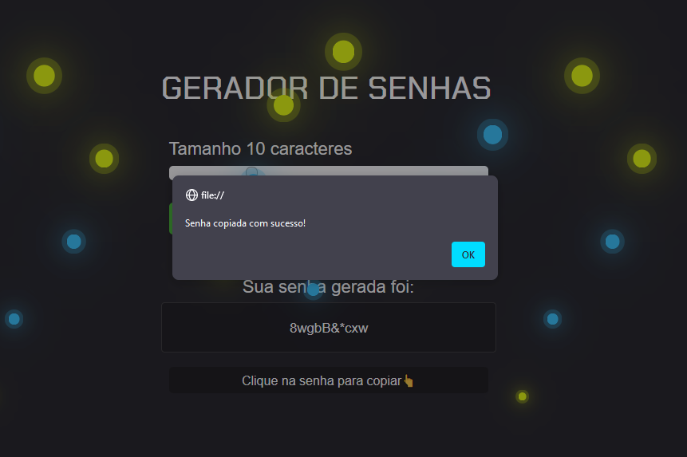

# Gerador de Senhas *****
Projeto para praticar a linguagem JavaScript.  

## Resultado

  
  

## REFERÊNCIA
Para realização do projeto de gerador de senhas foi utilizado o vídeo ["Criando projeto completo com HTML, CSS e JavaScript"](https://www.youtube.com/watch?v=i6t2jaRxos4), do canal Sujeito programador no [YouTube](https://www.youtube.com/).